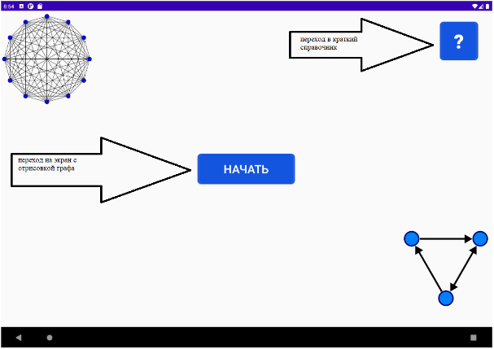
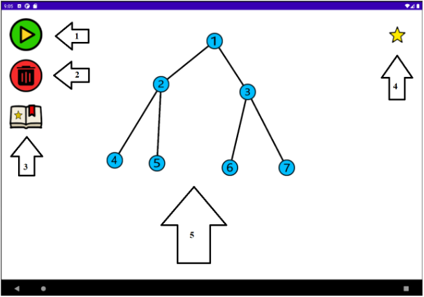
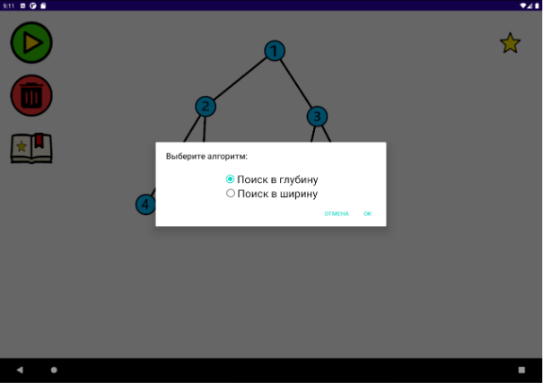
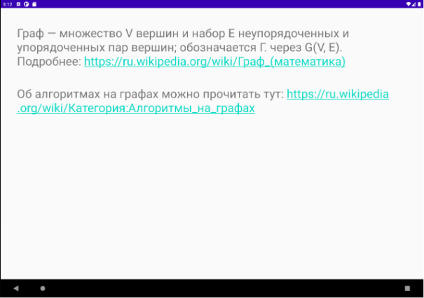

# Алгоритмы на графах

Интерактивное мобильное приложения для мобильной операционной системы Android, которое демонстрирует работу самых используемых алгоритмов на графах, таких как поиск в глубину, поиск в ширину.

## Как работает приложение?

Пользователю будет предоставлено поле, в котором он сможет сам построить граф, а после выбрать алгоритм, который он хочет рассмотреть на данном графе.

### Начальный экран

При нажатии кнопки «Начать» пользователь переходит на главный экран, где он может нарисовать и взаимодействовать с графом.

При нажатии кнопки «?» пользователь переходит в краткий справочник, где он может почитать теорию или перейти по ссылкам для более подробной информации.

### Экран взаимодействия с графом

1.	При нажатии на кнопку открывается диалоговое окно выбора алгоритма
2.	Кнопка очищения поля
3.	Кнопка отрисовки сохраненного графа
4.	Кнопка сохранения текущего графа
5.	Нарисованный граф

### Диалоговое окно выбора алгоритма

### Краткий теоретический справочник

## [Видео-демонстрация (ссылка)](https://disk.yandex.ru/i/701AbtBxZk0ixA)